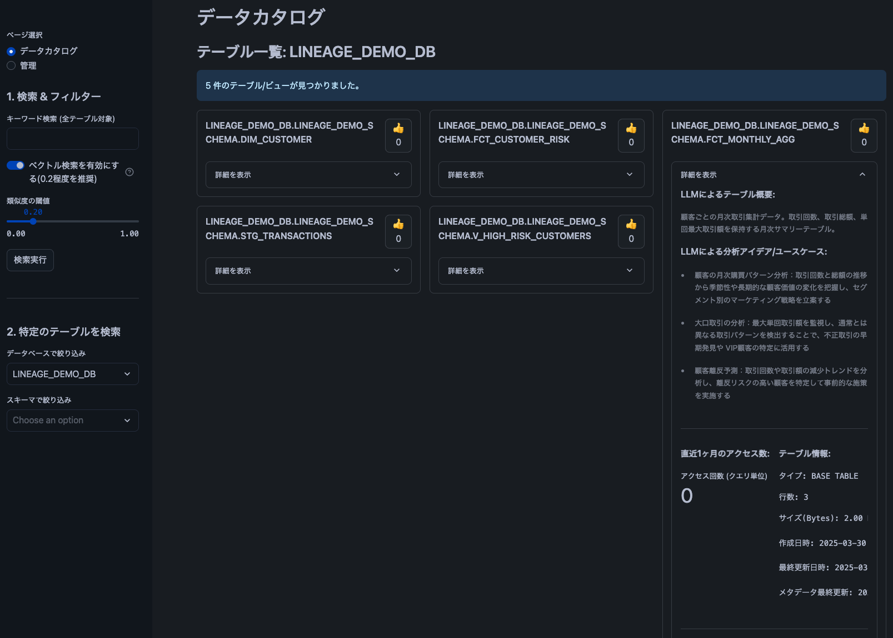
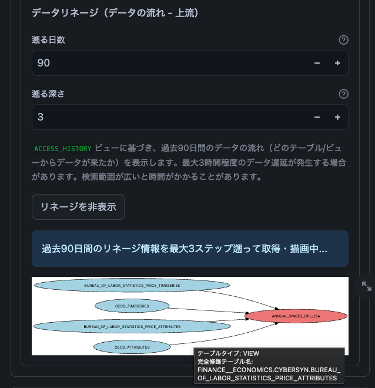
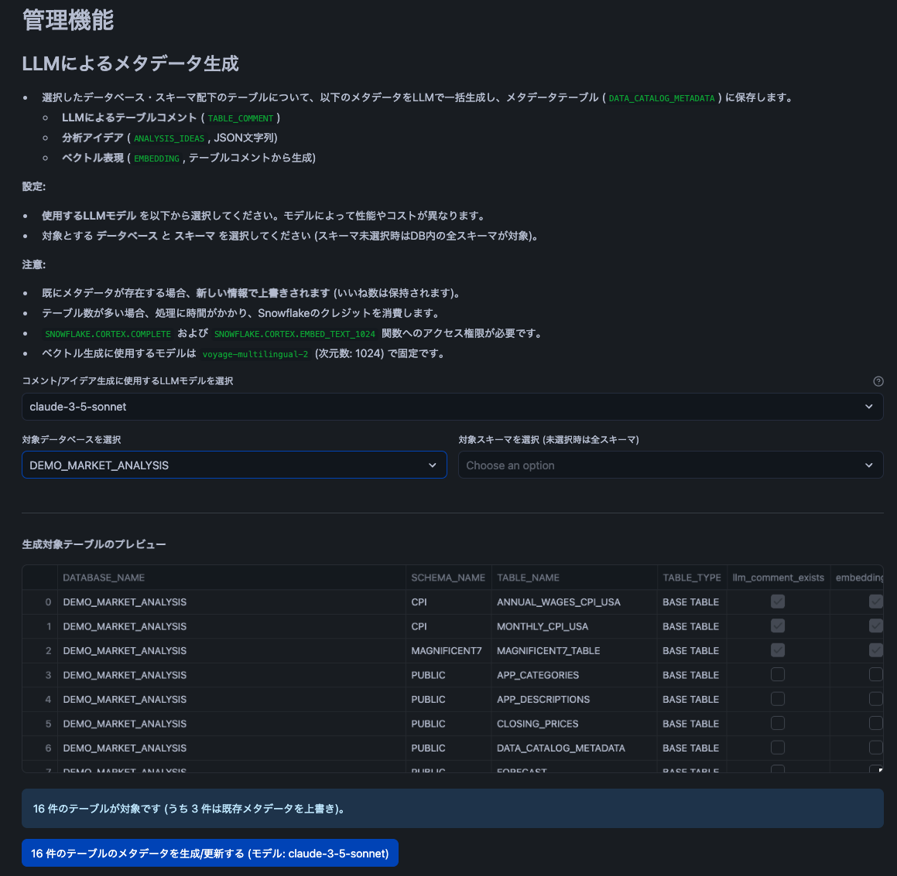

# Snowflake データカタログアプリ 

## 概要

このアプリケーションは、Snowflake内のデータ資産の可視性と理解を向上させるためのStreamlitアプリケーションです。Snowflake CortexのAI機能を活用して、テーブルの概要説明や分析アイデアを自動生成し、メタデータとして管理します。また、キーワード検索、ベクトル検索、データリネージ（データの流れ）の可視化機能を提供し、データ探索と活用を支援します。

データカタログの画面(メイン機能)    |データカタログの画面(リネージュ機能)      |管理ページの画面 
:--------------------:|:--------------------:|:--------------------:
||

## 主な機能

*   **データカタログブラウジング:** Snowflake内のデータベース、スキーマ、テーブル（ビュー含む）を階層的に探索できます。
*   **テーブル詳細表示:**
    *   基本的なテーブル情報（タイプ、行数、サイズ、作成/更新日時など）
    *   テーブル/カラムのコメント（Information Schemaから取得）
    *   直近1ヶ月のテーブルアクセス数（`ACCOUNT_USAGE.ACCESS_HISTORY`を使用）
*   **AIによるメタデータ拡張:**
    *   Snowflake Cortex LLM (例: `claude-3-5-sonnet`) を使用して、テーブルスキーマに基づいた**簡潔なテーブル概要**と**分析アイデア/ユースケース**を自動生成。
    *   生成されたコメントを元に、Snowflake Cortex Embedding (例: `voyage-multilingual-2`) を使用して**ベクトル (Embedding)** を生成・保存。
*   **高度な検索:**
    *   テーブル名、スキーマ名、コメントなどに含まれる**キーワード検索**。
    *   AIが生成したテーブルコメントのベクトルを利用した**ベクトル検索**（意味的な類似性に基づく検索）。
*   **データリネージ可視化:**
    *   `ACCOUNT_USAGE.ACCESS_HISTORY` を利用して、テーブルへのデータの流れ（上流の依存関係）を動的に追跡し、**Graphviz** を使って可視化。
    *   どのテーブル/ビューからデータが書き込まれたかを遡って表示。
*   **インタラクティブ機能:**
    *   テーブルカードごとの「いいね！」機能。
*   **管理機能:**
    *   特定のデータベース/スキーマ内の全テーブルに対して、AIによるメタデータ（コメント、アイデア、ベクトル）を一括生成・更新。

## 技術スタック

*   **言語:** Python 
*   **フレームワーク:** Streamlit
*   **データベース連携:** Snowflake Snowpark for Python
*   **AI機能:** Snowflake Cortex (LLM Functions, Embedding Functions)
*   **データ可視化:** Graphviz (データリネージ用)
*   **その他ライブラリ:** Pandas, JSON, Logging, RE

## 前提条件

*   **Snowflakeアカウント:**
    *   SnowparkおよびStreamlit in Snowflakeが利用可能なアカウント。
    *   **VECTOR型が有効化されている**こと。 ([参考: Snowflakeドキュメント](https://docs.snowflake.com/ja/user-guide/vector))
    *   **Snowflake Cortex** 関数 (`COMPLETE`, `EMBED_TEXT_*`) が利用可能であること。
*   **Python環境:** Python 3.8 以降。
*   **Graphviz:** データリネージの可視化機能を利用する場合、Graphvizの実行ファイルがシステムにインストールされ、PATHが通っている必要があります。
    *   [Graphviz 公式ダウンロードページ](https://graphviz.org/download/)
    *   OSによってはパッケージマネージャ (apt, brew, yumなど) でインストール可能です。
    *   インストール後、`dot` コマンドがターミナル/コマンドプロンプトで実行できることを確認してください。

## Snowflakeの準備

このアプリケーションを実行するには、Snowflake上で適切な権限を持つロールが必要です。`ACCOUNTADMIN` ロールを使用するのが最も簡単ですが、セキュリティ要件に応じて専用のロールを作成し、以下の権限を付与することを推奨します。

1.  **アプリケーションが動作するデータベース/スキーマ:**
    *   `USAGE` on DATABASE
    *   `USAGE` on SCHEMA
    *   `CREATE TABLE` on SCHEMA (初回起動時にメタデータテーブル `{METADATA_TABLE_NAME}` を作成するため)
    *   `SELECT`, `INSERT`, `UPDATE`, `MERGE` on テーブル `{METADATA_TABLE_NAME}` (メタデータの読み書きのため)
2.  **データソース（カタログ化対象）:**
    *   `USAGE` on データベース (対象DB)
    *   `USAGE` on スキーマ (対象スキーマ)
    *   `SELECT` on テーブル/ビュー (スキーマ情報取得、将来的なデータプレビュー等)
    *   `SELECT` on `INFORMATION_SCHEMA` (テーブル、カラム、コメント等のメタデータ取得のため)
3.  **Snowflake Account Usage スキーマ:**
    *   `IMPORTED PRIVILEGES` on DATABASE `SNOWFLAKE` (または、より限定的な権限)
    *   `USAGE` on SCHEMA `SNOWFLAKE.ACCOUNT_USAGE`
    *   `SELECT` on VIEW `SNOWFLAKE.ACCOUNT_USAGE.DATABASES` (データベース一覧取得の推奨方法)
    *   `SELECT` on VIEW `SNOWFLAKE.ACCOUNT_USAGE.ACCESS_HISTORY` (テーブルアクセス数、データリネージ取得のため)
    *   `SELECT` on VIEW `SNOWFLAKE.ACCOUNT_USAGE.QUERY_HISTORY` (データリネージ取得のため)
    *   **注意:** `ACCOUNT_USAGE` ビューへのアクセスには通常 `ACCOUNTADMIN` ロールが必要です。必要に応じて権限を付与してください。また、`ACCOUNT_USAGE` のデータには最大3時間の遅延があります。
4.  **Snowflake Cortex 関数:**
    *   `USAGE` on DATABASE `SNOWFLAKE.CORTEX` (または個別の関数に対する `USAGE`)
    *   `USAGE` on FUNCTION `SNOWFLAKE.CORTEX.COMPLETE(...)` (LLM利用のため)
    *   `USAGE` on FUNCTION `SNOWFLAKE.CORTEX.EMBED_TEXT_...(...)` (Embedding利用のため、コード内の `EMBED_FUNCTION_NAME` で指定されたもの)

## セットアップ

1. **実行方法:**
    * `setup.sql`を実行し環境をセットアップ
    * Snowsight上の左のタブで「Streamlit」を選択し、「+ Streamlitアプリ」を選択
    * アプリタイトルに「データカタログ」と記入
    * アプリの場所はデータベースを「DATA_CATALOG」、スキーマを「PUBLIC」を指定
    * アプリウェアハウスは「compute_wh」を指定し「作成」ボタンをクリック
    * Streamlitが起動した後、sis.pyをコピー＆ペースト

2.  **依存関係のインストール:**
    `requirements.txt` に記載されているライブラリをStreamlit in Snowflake上でインポートしてください。
    ```txt
    # requirements.txt
    streamlit
    snowflake-snowpark-python[pandas] # pandasも含む
    graphviz
    ```
    * 左上の「パッケージ」にて`python-graphviz`, `snowflake-ml-python`をインポート

## 設定項目
*   **モデルの選択:**
    * DEFAULT_LLM_MODEL: AIコメント/アイデア生成に使用するCortex LLMモデル名。(例: 'claude-3-5-sonnet', 'llama-70b')

    * DEFAULT_EMBEDDING_MODEL: ベクトル生成に使用するCortex Embeddingモデル名。(例: 'voyage-multilingual-2', 'snowflake-arctic-embed-l')

    * EMBEDDING_DIMENSION: 使用するEmbeddingモデルの次元数。(モデルに合わせて設定: 1024 など)

*   **テーブル名の選択:**
    * METADATA_TABLE_NAME: AIが生成したメタデータや「いいね」数を保存するSnowflakeテーブル名。 (デフォルト: "DATA_CATALOG_METADATA")

## 使い方
    * ページ選択: サイドバーで「データカタログ」または「管理」ページを選択します。

データカタログページ:
*   **機能:**
    * テーブルの閲覧: サイドバーでデータベースを選択し、必要に応じてスキーマで絞り込みます。選択された条件に一致するテーブル/ビューがメインエリアにカード形式で表示されます。

    * キーワード検索: サイドバーの検索ボックスにキーワードを入力し、「検索実行」ボタンを押します。メタデータテーブル内の情報（テーブル名、コメント、分析アイデアなど）を対象に検索します。

    * ベクトル検索: キーワード検索時に「ベクトル検索を有効にする」をオンにすると、検索語とAI生成コメント間のベクトル類似度で検索します。類似度の閾値も調整可能です。（事前に管理ページでベクトル生成が必要です）

    * テーブル詳細: 各テーブルカードの「詳細を表示」を展開すると、以下の情報が表示されます。

    * LLMによるテーブル概要と分析アイデア/ユースケース

    * 元のテーブルコメント (Information Schema)

    * 直近1ヶ月のアクセス数

    * テーブルの基本情報（タイプ、行数、サイズ、日時など）

    * データリネージ（上流）

    * メタデータ生成: 詳細表示内で、メタデータが未生成の場合に「AIで概要と分析アイデアを生成」ボタンが表示され、個別に生成・保存できます。

    * いいね: 各テーブルカード右上の「👍」ボタンで、テーブルに「いいね」を付けることができます。

    * データリネージ: 詳細表示内で、遡る日数と深さを設定し、「リネージを表示/更新」ボタンを押すと、データの流れ（上流）がグラフで表示されます。グラフのエッジ（矢印）にカーソルを合わせると、関連するQuery IDなどの情報が表示されます。

管理ページ:
*   **機能:**
    * データベースとスキーマ（任意）を選択します。

    * 対象となるテーブルのプレビューが表示されます（メタデータ有無含む）。

    * 「...件のテーブルのメタデータを生成/更新する」ボタンを押すと、選択された範囲の全テーブルに対して、AIによるコメント、分析アイデア、ベクトルの生成・保存処理を一括で実行します。

    * 注意: テーブル数が多い場合、処理に時間がかかり、Snowflakeクレジットを消費します。

データリネージ機能について
*   **機能:**
    * SNOWFLAKE.ACCOUNT_USAGE.ACCESS_HISTORY および SNOWFLAKE.ACCOUNT_USAGE.QUERY_HISTORY ビューに依存しています。これらのビューへのアクセス権限が必要です。

ACCOUNT_USAGE のデータには最大3時間の遅延があるため、リネージ情報もリアルタイムではありません。
*   **確認事項:**
    * リネージグラフの描画には Graphviz が必要です。ローカル環境で実行する場合は、Graphvizがインストールされ、PATHが通っていることを確認してください。Streamlit in Snowflake 環境では、Graphvizが利用可能か確認が必要です（環境によっては利用できない場合があります）。

    * 現在は**上流（Upstream）**のリネージ、つまり対象テーブルにデータを書き込んだソースを遡る方向のみサポートしています。

    * 複雑なデータフローや大量の履歴がある場合、リネージの取得と描画に時間がかかることがあります。サイドバーで検索対象の日数や遡る深さを調整してください。

## 注意点/制限事項
Snowflakeクレジット: Snowflake Cortex関数（LLM, Embedding）の利用および ACCOUNT_USAGE へのクエリ実行は、Snowflakeクレジットを消費します。特に管理ページでの一括処理は注意が必要です。

権限: アプリケーションが必要とする各種Snowflakeオブジェクト（テーブル、ビュー、関数など）へのアクセス権限が正しく設定されていない場合、機能が制限されたり、エラーが発生したりします。

ACCOUNT_USAGEの遅延: ACCOUNT_USAGE スキーマのデータ（アクセス数、リネージ情報など）には最大3時間の遅延があります。
